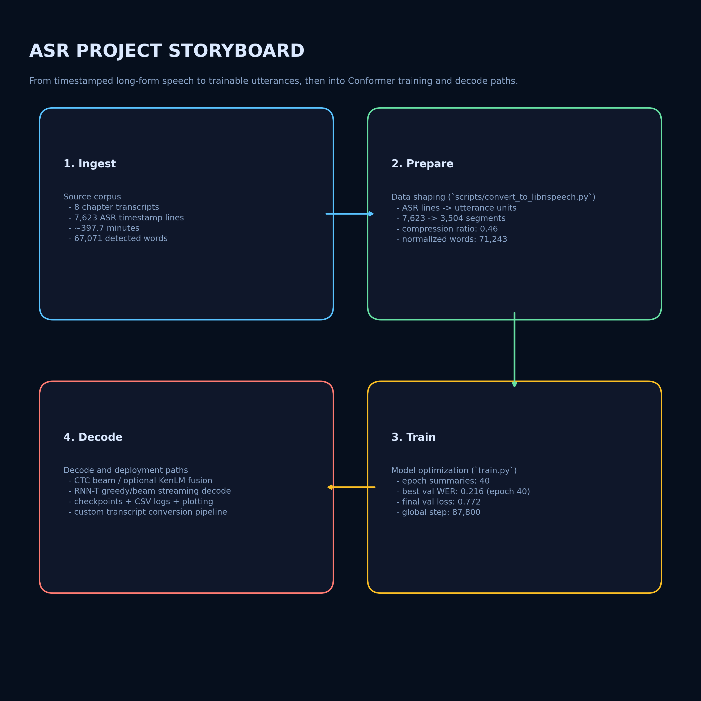
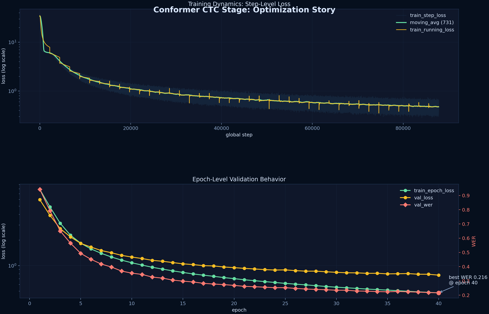
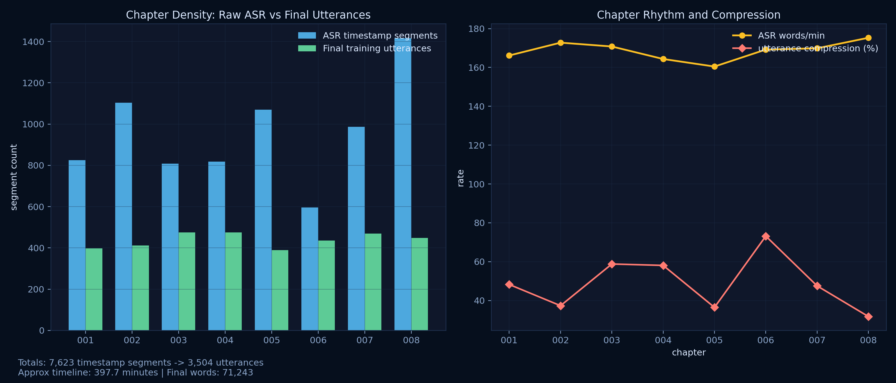
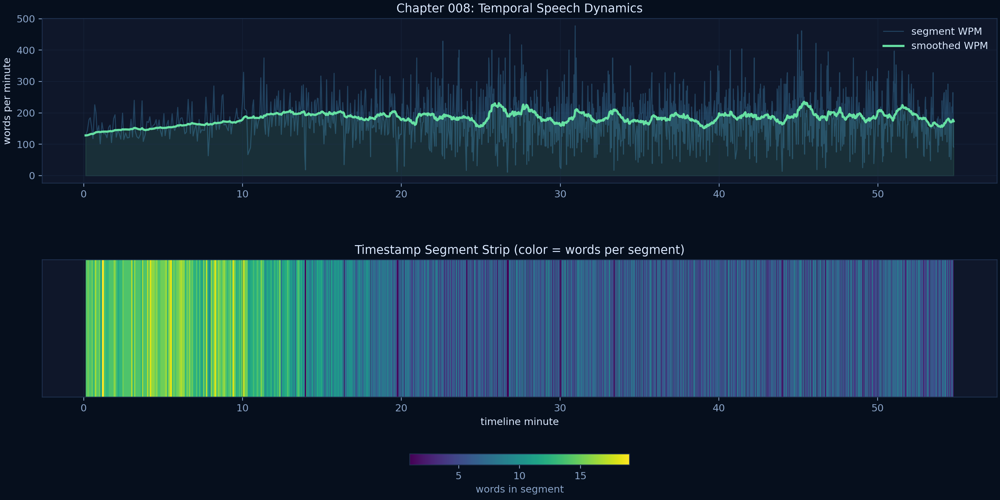

# ASR

Conformer-based automatic speech recognition project with both CTC and RNN-T training/inference paths.

The codebase includes:
- Full training loop (`train.py`) for CTC or RNN-T.
- Conformer encoder implementation with RoPE + RMSNorm.
- Character and SentencePiece tokenization.
- CTC beam search, optional KenLM fusion (`pyctcdecode`), and RNN-T greedy/beam decoding.
- Dataset tooling for LibriSpeech and custom timestamped transcripts (Jerome Powell data prep pipeline).

## Visual Overview

This project now has story-driven visuals generated from real artifacts in this checkout (`training_log.csv` + Jerome Powell timestamp files + converted `.trans.txt` outputs).

### 1) Pipeline story: ingest -> prepare -> train -> decode



### 2) Optimization behavior: step-level and epoch-level signals



### 3) Dataset footprint: chapter density and compression behavior



### 4) Timeline lens: chapter `008` temporal speech dynamics




## What Is In This Repository

Core code:
- `train.py`: main trainer (single GPU or DDP), eval, checkpointing, CSV logging.
- `transcribe.py`: offline CTC transcription from checkpoint + audio.
- `decoding.py`: CTC and RNN-T decoding algorithms.
- `model/`: Conformer blocks and model definitions (`ConformerASR`, `ConformerTransducer`).
- `preprocessing/`: log-mel extraction, SpecAugment, LibriSpeech dataset wrapper + dataloader.
- `tokenizer/`: `CharTokenizer`, `SentencePieceTokenizer`, vocab constants.

Utility scripts:
- `scripts/download_librispeech_960h.py`: dataset download helper.
- `scripts/prepare_tokenizer.py`: train SentencePiece model from LibriSpeech transcripts.
- `scripts/eval_ctc_librispeech.py`: evaluate CTC checkpoint on test splits.
- `scripts/decode_checkpoint_sample.py`: decode one sample utterance from checkpoint.
- `scripts/transcribe_streaming_rnnt.py`: chunked/streaming-style RNN-T decode with latency/RTF metrics.
- `scripts/caption_video_rnnt.py`: burn right-aligned live-style captions onto video from streaming RNN-T ASR.
- `scripts/plot_training_log.py`: plot CSV training logs.
- `scripts/convert_to_librispeech.py`: convert timestamped transcript + source audio into LibriSpeech-style dataset tree.
- `scripts/train_conformer_m_ctc_960.sh`: 2-stage CTC -> RNN-T pipeline launcher.
- `scripts/train_finetune_jerome_powell_ctc.sh`: wrapper for Jerome Powell fine-tuning workflow (see known issues below).
- `scripts/generate_readme_visuals.py`: generate story-first README visualizations from logs + dataset artifacts.

Data/model artifacts currently tracked in repo:
- `dataset/` (pre-segmented Jerome Powell audio + transcripts, plus eval subset).
- `lm/` (3-gram ARPA LM files).
- Multiple checkpoint directories and benchmark logs.

## Environment Setup

Python:
- Recommended: Python 3.12 (repo-local `env/` currently uses 3.12.6).

Install core deps:

```bash
pip install -r requirements.txt
```

Install LM decode deps (optional, for CTC+KenLM):

```bash
pip install -r requirements-lm.txt
```

Notes:
- `sentencepiece` is required by import path, even if you intend to run char-tokenizer mode.
- Optional RNN-T backend `k2` is supported (`--rnnt-loss-impl k2_pruned`) but not pinned in requirements; install separately if needed.
- Bash scripts assume Linux/WSL/Git-Bash and tools like `ffmpeg`.

## Dataset Layout Expected By Code

LibriSpeech root:

```text
<data_root>/
  LibriSpeech/
    train-clean-100/
    train-clean-360/
    train-other-500/
    dev-other/
    test-clean/
    test-other/
```

Each split uses standard LibriSpeech files (`*.flac` + `<speaker>-<chapter>.trans.txt`).

`preprocessing/LibriSpeechASR` also handles an alternate nested extraction:
- `.../LibriSpeech/<split>/<split>/...`

### Jerome Powell Data In This Checkout

This repository currently contains a prepared custom dataset under:
- `dataset/JeromePowell/9999/{001..008}`
- `dataset/_eval_jerome_powell_all_clean/LibriSpeech/dev-clean/9999/{001..008}`

Snapshot (current tree):
- `dataset/JeromePowell`: 3,508 `.flac` segments + chapter `.trans.txt` + generated `split_audio.sh`.
- `dataset/_eval_jerome_powell_all_clean/.../dev-clean`: 3,500 `.flac` segments for evaluation.

### Download LibriSpeech

```bash
python scripts/download_librispeech_960h.py --data-root ./data
```

## Tokenizer

Two supported tokenizers:
- `char`: 29-symbol vocab (`<blank>`, space, apostrophe, a-z).
- `sp`: SentencePiece model, with token IDs shifted by +1 so blank stays at index 0.

Train SentencePiece (paper-style 1024 total vocab = 1023 SP + blank):

```bash
python scripts/prepare_tokenizer.py \
  --data-root ./data \
  --splits train-clean-100 train-clean-360 train-other-500 \
  --vocab-size 1023 \
  --model-prefix ./tokenizer/sp_1k
```

## Training

### 1) Direct `train.py` (primary entrypoint)

Default mode is RNN-T with large Conformer-style defaults.

Basic CTC run:

```bash
python train.py \
  --loss-type ctc \
  --data-root ./data \
  --train-splits train-clean-100 \
  --val-split dev-other \
  --tokenizer sp \
  --sp-model ./tokenizer/sp_1k.model \
  --batch-size 32 \
  --epochs 10 \
  --ckpt-dir ./checkpoints_ctc
```

Basic RNN-T run:

```bash
python train.py \
  --loss-type rnnt \
  --data-root ./data \
  --train-splits train-clean-100 \
  --val-split dev-other \
  --tokenizer sp \
  --sp-model ./tokenizer/sp_1k.model \
  --batch-size 16 \
  --accum-steps 4 \
  --epochs 10 \
  --ckpt-dir ./checkpoints_rnnt
```

Distributed launch example:

```bash
torchrun --standalone --nproc_per_node=4 train.py [args...]
```

Important training features implemented:
- CTC and RNN-T loss support.
- Optional RNNT chunked loss to limit `batch * T * U` memory pressure (`--rnnt-max-batch-tu`).
- Optional `k2_pruned` RNNT loss backend.
- Mixed precision (`fp16`/`bf16`), TF32 toggles, optional `torch.compile`.
- DDP with configurable bucket size, timeout, bucket-view gradients.
- Variational noise regularization.
- Auto-resume from `<ckpt-dir>/last.pt` unless disabled.
- Early stopping by validation WER (`--early-stop-patience`).
- Optional epoch-end sample decode.

### 2) Two-stage script pipeline

`scripts/train_conformer_m_ctc_960.sh` runs:
1. Stage 1: Conformer-M CTC pretraining.
2. Stage 2: RNN-T training with encoder warm-start from stage 1 best checkpoint.

Run:

```bash
bash scripts/train_conformer_m_ctc_960.sh
```

Override settings via env vars, e.g.:
- `NPROC_PER_NODE`, `DATA_ROOT`, `RUN_ROOT`, `CTC_BATCH_SIZE`, `RNNT_BATCH_SIZE`, etc.

## Evaluation

Evaluate a CTC checkpoint on LibriSpeech splits:

```bash
python scripts/eval_ctc_librispeech.py \
  --checkpoint ./checkpoints_ctc/best.pt \
  --data-root ./data \
  --splits test-clean test-other \
  --beam-size 20
```

With KenLM:

```bash
python scripts/eval_ctc_librispeech.py \
  --checkpoint ./checkpoints_ctc/best.pt \
  --data-root ./data \
  --splits test-clean test-other \
  --lm-path ./lm/3-gram.pruned.1e-7.lower.arpa \
  --lm-alpha 0.5 \
  --lm-beta 1.0 \
  --lm-beam-width 128
```

## Inference / Transcription

### CTC offline transcription

```bash
python transcribe.py \
  --checkpoint ./checkpoints_ctc/best.pt \
  --audio ./audio/example.wav \
  --beam-size 10
```

With LM fusion:

```bash
python transcribe.py \
  --checkpoint ./checkpoints_ctc/best.pt \
  --audio ./audio/example.flac \
  --lm-path ./lm/3-gram.pruned.1e-7.lower.arpa \
  --lm-alpha 0.5 \
  --lm-beta 1.0 \
  --lm-beam-width 128
```

### RNN-T streaming-style transcription

```bash
python scripts/transcribe_streaming_rnnt.py \
  --checkpoint ./checkpoints_rnnt/best.pt \
  --audio ./audio/example.flac \
  --chunk-size-enc 8 \
  --left-context-chunks -1 \
  --right-context 0 \
  --max-symbols-per-step 5
```

Outputs include:
- transcript (`hyp`)
- decode time, audio time, real-time factor (`rtf`)
- first-token latency estimate

### Video Caption Burn-In (RNN-T, right-aligned + left-cropped tail)

Given a video, this runs streaming RNN-T ASR and burns captions near the bottom-right.

The rendered text is intentionally cropped from the left:
- keep a larger trailing context window (`--context-words`)
- display only the final few words (`--display-words`)

```bash
python scripts/caption_video_rnnt.py \
  --checkpoint ./checkpoints_rnnt/best.pt \
  --video ./media/input.mp4 \
  --output ./media/input.captioned.mp4 \
  --context-words 18 \
  --display-words 6 \
  --bottom-margin 58 \
  --right-margin 72
```

This script requires `ffmpeg` + `ffprobe` on PATH.

### Decode a single dataset sample from checkpoint

```bash
python scripts/decode_checkpoint_sample.py \
  --checkpoint ./checkpoints_rnnt/last.pt \
  --data-root ./data \
  --split dev-other
```

## Custom Data Conversion (Timestamped Transcript -> LibriSpeech Format)

Use `scripts/convert_to_librispeech.py` to:
- parse timestamped transcript text,
- normalize text (numbers, percentages, punctuation cleanup),
- merge into sentence-level utterances,
- generate LibriSpeech-style `.trans.txt`,
- emit `split_audio.sh` with `ffmpeg` commands per utterance.

Example:

```bash
python scripts/convert_to_librispeech.py \
  --transcript ./transcript.txt \
  --audio ./source_audio.m4a \
  --speaker-id 9999 \
  --chapter-id 001 \
  --output-dir ./dataset \
  --run-split
```

## Logs, Plots, and Checkpoints

Training writes:
- `last.pt` and `best.pt` in `--ckpt-dir`.
- CSV log (default `<ckpt-dir>/training_log.csv`) with:
  - per-step rows (`train_step`)
  - per-epoch summary rows (`epoch_summary`)

Plot log:

```bash
python scripts/plot_training_log.py ./checkpoints_ctc/training_log.csv
```

## Model/Decoding Implementation Notes

Architecture details from `model/` + `preprocessing/`:
- 2-layer conv subsampling (4x time reduction).
- Conformer block with:
  - macaron FFN,
  - multi-head self-attention with RoPE,
  - depthwise conv module with GLU gating,
  - RMSNorm.
- Streaming attention mask support:
  - chunk size,
  - left-context chunks,
  - right-context lookahead,
  - optional causal conv.
- Per-utterance feature normalization and optional SpecAugment (F=27, 2 freq masks, 10 time masks with pS=0.05).

Decoding details from `decoding.py`:
- CTC prefix beam search in pure Python.
- Optional `pyctcdecode` + KenLM shallow fusion for CTC.
- RNN-T greedy decode and beam search (beam search supports optional LM hook).

## Known Issues / Repository Gaps

1. `scripts/train_finetune_jerome_powell_ctc.sh` references `scripts/finetune_conformer_m_ctc_dataset.sh`, but that script is not present in this repository.
2. Some script defaults reference non-present files, e.g. `lm/4-gram.lower.arpa`, `lm/4-gram.lower.bin`, `checkpoints_conformer_l_4xh200/last.pt`, `checkpoints_dev_other/training_log.csv`.
3. Repo tracks large binary assets (`dataset`, `*.pt`, ARPA files), so clone size is large.
4. `requirements.txt` includes notebook/dev packages; for lean runtime installs, create a minimal requirements set if needed.

## Suggested Workflow

1. Install dependencies (`requirements.txt`, optionally `requirements-lm.txt`).
2. Download LibriSpeech (`scripts/download_librispeech_960h.py`).
3. Train tokenizer (`scripts/prepare_tokenizer.py`) or reuse `tokenizer/sp_1k.model`.
4. Train CTC first (faster iteration), validate with `scripts/eval_ctc_librispeech.py`.
5. Warm-start RNN-T from CTC encoder (`--init-encoder-from`) for final model quality.
6. Use `transcribe.py` (CTC) or `scripts/transcribe_streaming_rnnt.py` (RNN-T streaming-style) for inference.
